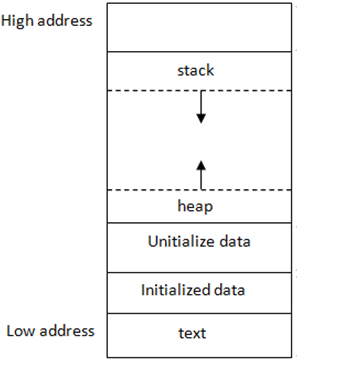

# Stack vs. Heap memory

## Summary

- `stack` -> memory automatically controlled; `heap` -> manually controlled, `new` & `delete`;

- Faster in use, smaller memory size, tmporary use --> using `stack`
- Global variable, larger memory, resizable --> using `heap`

### General Memory Layout

`stack`: Stores _local_ variables;  
`heap`: Dynamic memory for programming to allocate;  
`data`: Stores _global_ variables, separated into **initialized** and **uninitialized**;  
`text`: Stores the code being executed;

    

> Note  
> By convention, we express these addresses in base 16 numbers.
> For instance, the smallest possible address is 0x00000000 (where the 0x means base 16),
> and the largest possible address could be 0xFFFFFFFF.

## Stack

- Temporary memory.
- The allocation and deallocation for stack memory is automatically done.

## Heap

- heap memory is allocated explicitly by programmers and it won’t be deallocated until it is explicitly freed
- To allocate heap memory in C++, use the keyword `new`
- Could lead to `memory leak` (momory not released, and cannot be accessed)
- `delete` and set the pointer to `nullptr` is a good practice.

## References

[CS225-Stack-Heap](https://courses.engr.illinois.edu/cs225/sp2022/resources/stack-heap/) 
[Stack-Heap-Difference](https://www.guru99.com/stack-vs-heap.html) 
[geeksforgeeks-wt-codes](https://www.geeksforgeeks.org/stack-vs-heap-memory-allocation/) 
